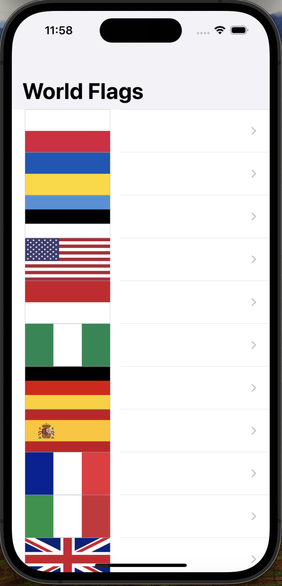
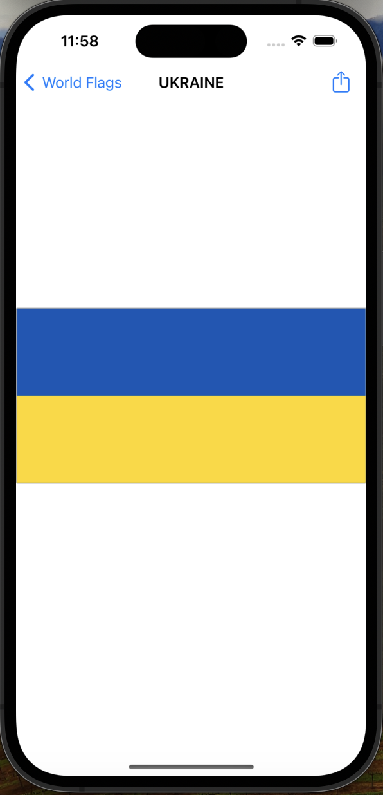

# WorldFlags

WorldFlags is a simple iOS app that displays a list of world flags and allows users to view the details of each flag.

## Table of Contents

* [Features](#features)
* [Screenshots](#screenshots)
* [Requirements](#requirements)
* [Usage](#usage)
* [Code Overview](#code-overview)

## Features

* Displays a list of world flags
* Allows users to view the details of each flag
* Includes a share feature to share the flag image

## Screenshots

  
   
  <em>Flag List Screen</em>

  
   
  <em>Flag Details Screen</em>

## Requirements

* iOS 12.0+
* Xcode 12.0+
* Swift 5.0+

## Usage

1. Launch the app.
2. View the list of world flags.
3. Tap on a flag to view its details.
4. Share the flag image with friends.

## Code Overview

### ViewController

* Manages the list of flags and displays them in a table view.
* Handles user interactions, such as selecting a flag to view its details.

### DetailViewController

* Displays the details of a selected flag, including its image and title.
* Includes a share feature to share the flag image.

## Possible Improvements

* Add more features, such as filtering by region or country.
* Implement animations for flag transitions.
* Add a search function to find specific flags.
* Improve the user interface design.
